# Secure AWS VPC Architecture

## Project Overview

This project demonstrates the deployment of a secure AWS Virtual Private Cloud (VPC) architecture that isolates internal resources while allowing controlled administrative access and outbound internet connectivity.

The environment includes public and private subnets, a bastion host for secure SSH access, a NAT gateway for outbound connectivity from private resources, and AWS CloudTrail for logging and auditing.

---

## Architecture

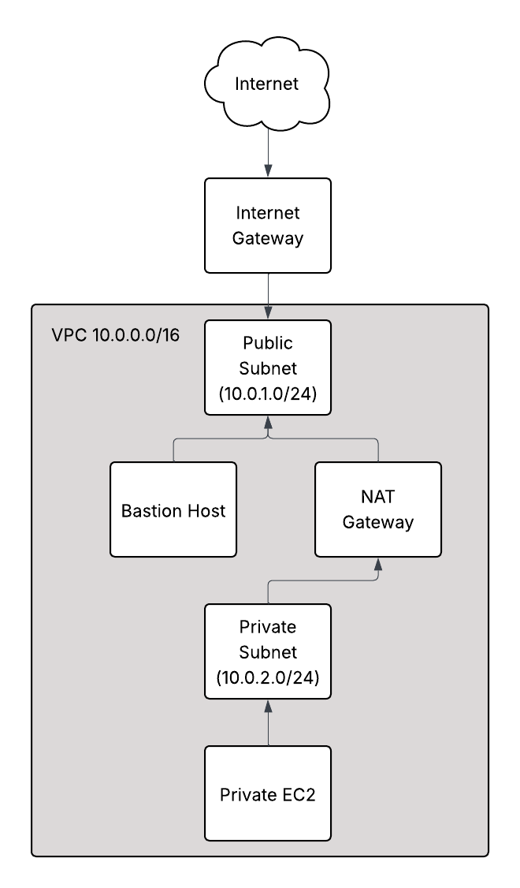

---

## Components

### VPC
A Virtual Private Cloud provides an isolated network environment within AWS where resources are deployed.

### Public Subnet
Contains the bastion host which allows controlled SSH access into the environment.

### Private Subnet
Contains internal EC2 instances that are not directly accessible from the internet.

### Bastion Host
A publicly accessible EC2 instance used as a secure jump server to access private resources.

### NAT Gateway
Allows private subnet resources to access the internet without exposing them to inbound internet traffic.

### Security Groups
Act as stateful firewalls controlling inbound and outbound traffic for EC2 instances.

### CloudTrail
Records AWS API activity for auditing and security monitoring.

---

## Security Design

This architecture follows several cloud security best practices:

• Isolation of public and private resources  
• Bastion host for controlled administrative access  
• Private instances without public IP addresses  
• Outbound-only internet access via NAT gateway  
• Logging of infrastructure activity using CloudTrail

---

## Deployment Verification

### VPC Created

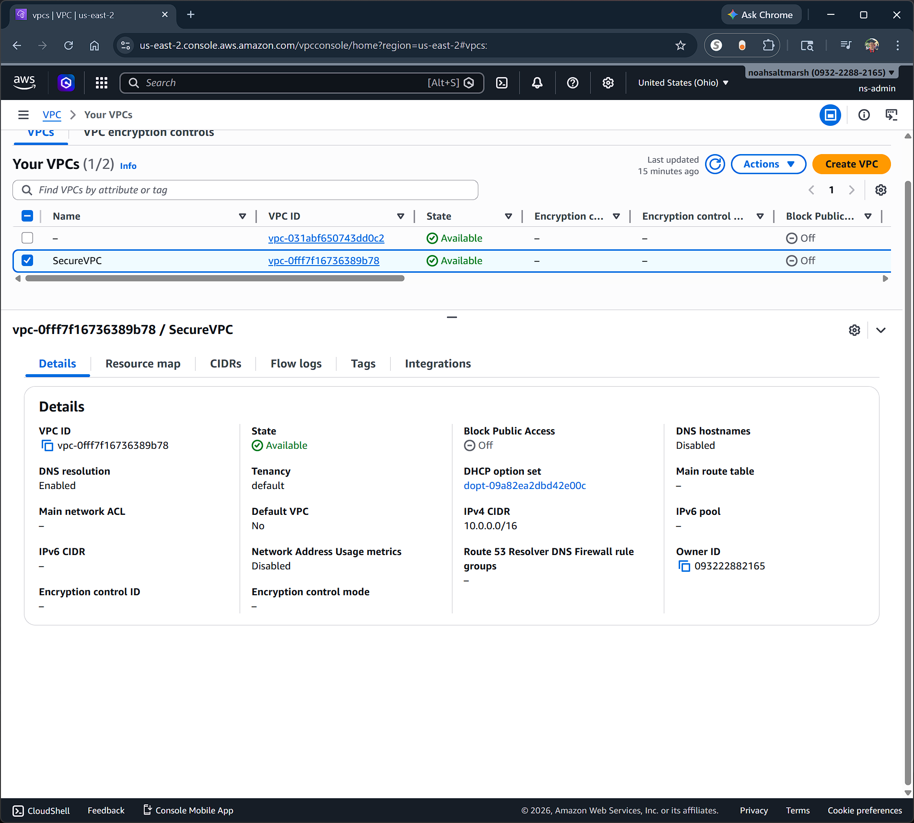

---

### Subnets Created

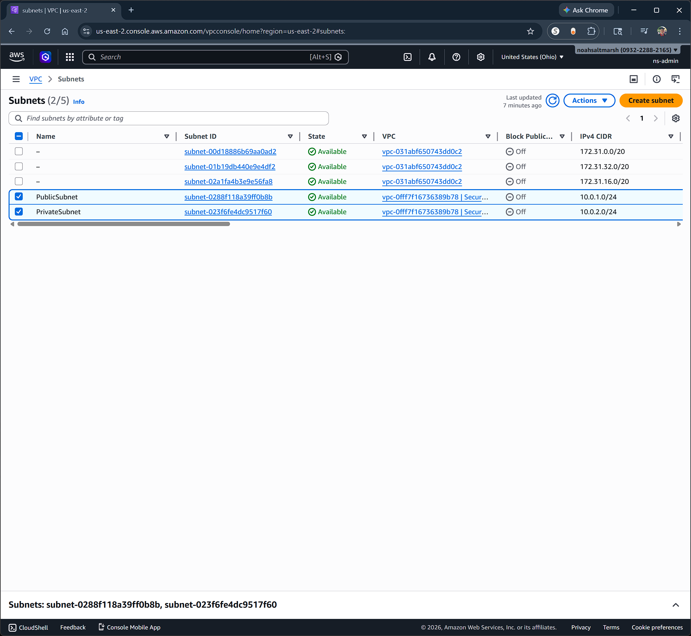

---

### Internet Gateway

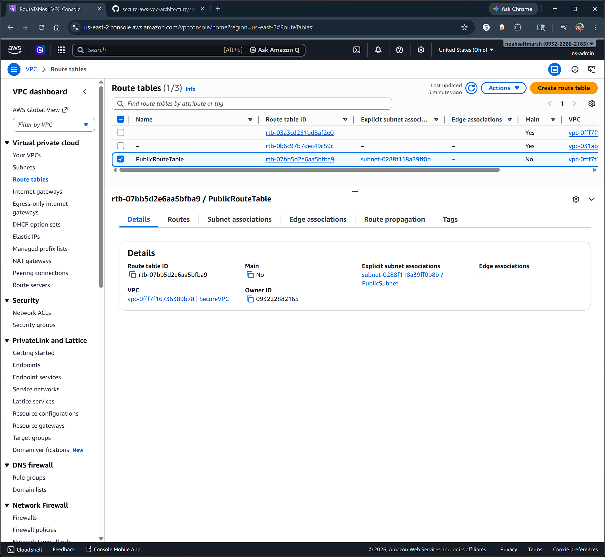

---

### NAT Gateway

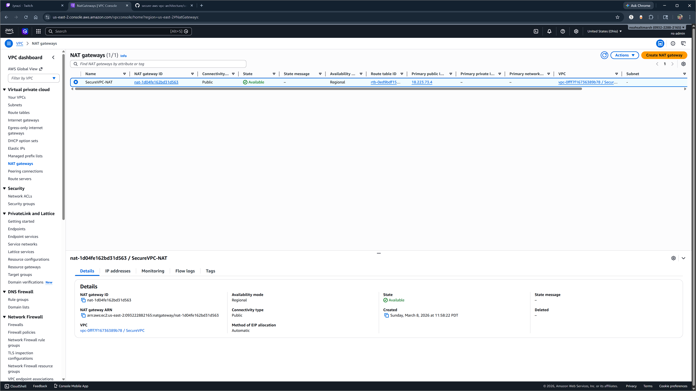

---

### Bastion Host Instance

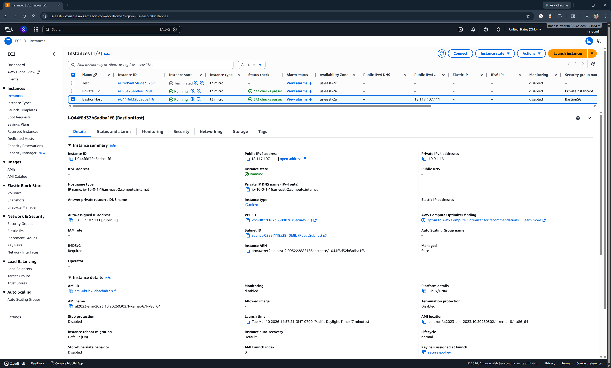

---

### Bastion Security Group

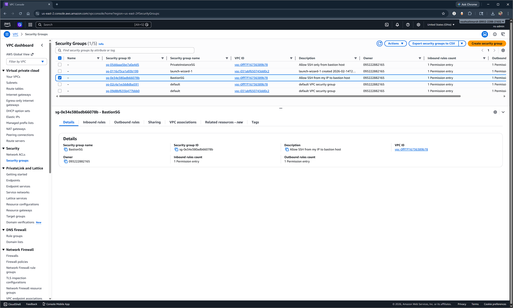

---

### Private EC2 Instance

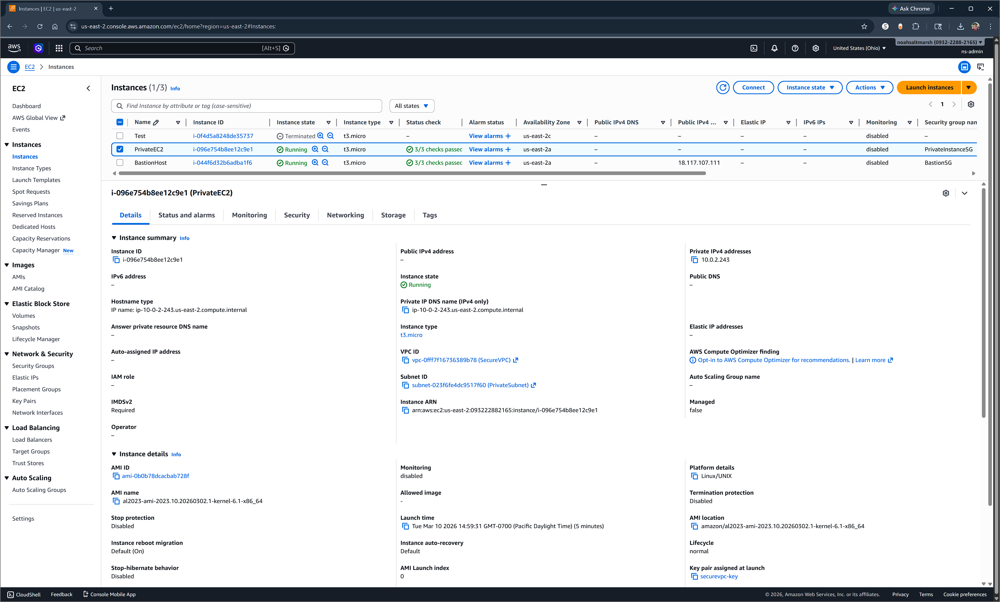

---

### Private Instance Security Group

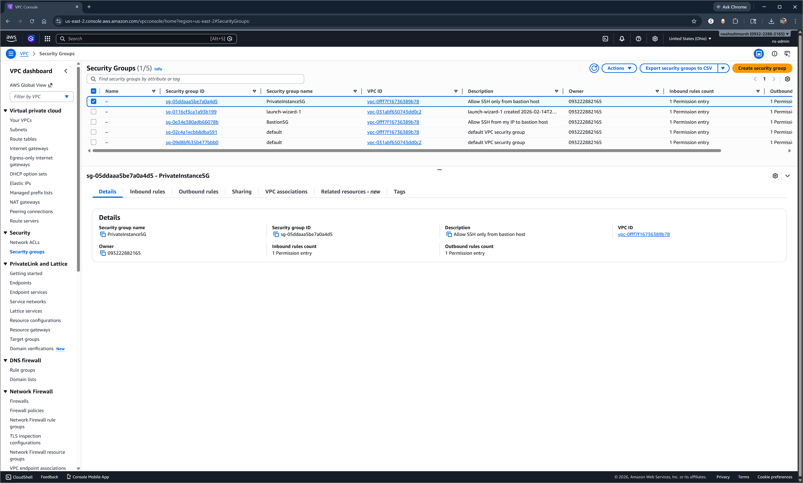

---

### Public Route Table

---

### Private Route Table

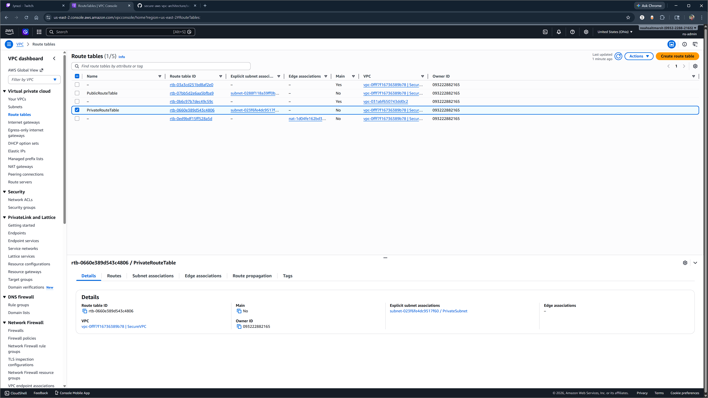

---

### CloudTrail Enabled

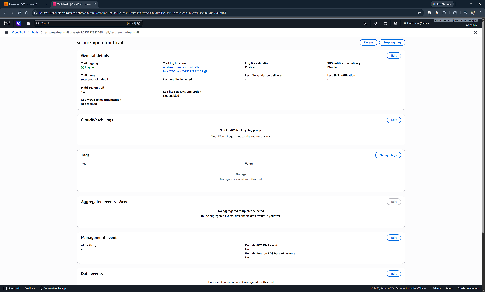

---

## Technologies Used

AWS VPC  
AWS EC2  
AWS NAT Gateway  
AWS Internet Gateway  
AWS Security Groups  
AWS CloudTrail  
Linux (Amazon Linux 2023)  
SSH
